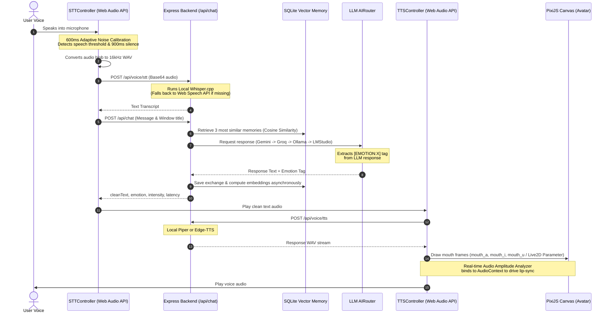

# VTuber Companion — Technical Architecture & Analysis

VTuber Companion is an interactive, floating desktop assistant that features a transparent, animated anime avatar (acting as a VTuber overlay) running locally on Linux. It incorporates Speech-to-Text (STT), Text-to-Speech (TTS), Local/Cloud Large Language Models (LLMs) with fallback routing, real-time lip-sync, and semantic vector memory.

---

## 1. High-Level Tech Stack
The application is divided into three key layers:

| Layer | Technology | Key Responsibility |
| :--- | :--- | :--- |
| **Window Host** | Electron | Frameless overlay, click-through boundaries, desktop shaking gestures, tray controls. |
| **UI & Animation** | React, PixiJS | 2D animation, blinking loops, cursor tracking (pupil parallax), subtitle rendering, audio analyzer. |
| **Live2D Renderer** | pixi-live2d-display | Cubism Core integration, 3D mouse gaze follow, lip-sync overrides, emotion motion triggers. |
| **Logic & Engine** | Node.js Express, SQLite, C++ binaries | Local Whisper.cpp (STT), Piper (TTS), fallback LLM Router, semantic vector memory storage & similarity calculations. |

---

## 2. Core Execution Flow

The voice interaction loop represents a unified data-flow pipeline:



---

## 3. Core Module Deep Dive

### 3.1. Main Window Host ([electron/main.js](file:///home/nanu/linux/vtuber-companion/electron/main.js))
- **Transparent Overlay**: Creates a borderless transparent window skipping the taskbar with screen-saver top-priority level:
  ```javascript
  mainWindow.setAlwaysOnTop(true, 'screen-saver');
  ```
- **Shaking Detection**: Records a history of coordinates when the window is dragged. If direction reversals cross `SHAKE_THRESHOLD` (5 changes) within `SHAKE_WINDOW_MS` (800ms) with at least `SHAKE_MIN_DELTA` (15px), it emits a `window-shaking` IPC notification. The companion reacts to this by getting angry and telling the user to stop shaking her.
- **Window Boundaries**: Handles dynamic resizing when settings are toggled (switching boundaries between $240 \times 340$ and $400 \times 520$) keeping the bottom-right corner anchored.

### 3.2. PixiJS Rendering Engine ([src/components/Avatar/AvatarSprite.jsx](file:///home/nanu/linux/vtuber-companion/src/components/Avatar/AvatarSprite.jsx))
- **Dynamic Texturing**: Manages loading textures, blending blink animations, and displaying the active expression (`happy`, `angry`, `embarrassed`, `excited`, `sleepy`, `smug`, `shocked`, `thinking`).
- **Mouth Overlay & Crop**: Rather than swapping the entire body sprite for speaking frames, it crops a sub-region (mouth box) from mouth templates and layers it as a sub-sprite:
  ```javascript
  const mouthFrame = new PIXI.Rectangle(445, 485, 130, 75);
  ```
  This preserves the active emotion shown in the eyes/eyebrows while allowing the mouth to move independently.
- **Blinking Controller ([BlinkController.js](file:///home/nanu/linux/vtuber-companion/src/components/Avatar/BlinkController.js))**: Triggers random blinking sequences (2-6s interval) with a 15% probability of double blinks using a half-closed and fully-closed state-machine.
- **Eye & Pupil Tracking ([EyeTracker.js](file:///home/nanu/linux/vtuber-companion/src/components/Avatar/EyeTracker.js))**: Calculates mouse cursor angle relative to the center of the avatar and LERPs (linear interpolates) the avatar's position slightly to simulate natural gaze tracking.
- **Physical Animations**:
  - *Angry*: Rapid horizontal sinusoid jitter decay.
  - *Excited*: Buoyant vertical jumping + slight scale bounce.
  - *Sleepy*: Slow horizontal sway.
  - *Shocked*: Extreme recoil + high-frequency jitter.

### 3.3. Live2D Rendering & Motion Mapping ([Live2DAvatar.jsx](file:///home/nanu/linux/vtuber-companion/src/components/Avatar/Live2DAvatar.jsx))
- **Cubism Core Runtime**: Integrates `live2dcubismcore.min.js` (from public directory) globally via a `<script>` tag in [index.html](file:///home/nanu/linux/vtuber-companion/index.html) to allow parsing of `.moc3` binary nodes at runtime.
- **Auto-Blinking & Gaze Gaze Focus**: Binds mouse movements globally to normalized coordinates $[-1.0, 1.0]$ and updates `model.focus(focusX, focusY)` in the ticker loop. Native eye-blink parameters (`ParamEyeLOpen`, `ParamEyeROpen`) are updated by the internal Cubism physics engine.
- **Motion Trigger Mapping**: Hooks into the assistant's active emotional state updates and triggers corresponding motion tracks within the Hiyori Cubism package:
  - `angry` $\implies$ FlickDown (`hiyori_m04.motion3.json`)
  - `excited` $\implies$ FlickUp (`hiyori_m06.motion3.json`)
  - `happy` $\implies$ Tap (`hiyori_m07.motion3.json`)
  - `embarrassed` $\implies$ Flick@Body (`hiyori_m10.motion3.json`)
  - `shocked` $\implies$ Flick (`hiyori_m03.motion3.json`)
  - `thinking` $\implies$ Tap@Body (`hiyori_m09.motion3.json`)
- **Lip-Sync Parameter Overrides**: To avoid motions overriding speech animations, `model.automator.autoUpdate` is set to `false`. Inside the ticker callback, `model.update(elapsedMs)` runs, immediately followed by overriding `ParamMouthOpenY` using the EventBus audio amplitude:
  ```javascript
  model.update(elapsed);
  model.setParameterValueById('ParamMouthOpenY', amp * 1.3);
  ```
- **PixiJS v7 Interaction Safety**: To prevent `TypeError: manager.on is not a function` caused by PixiJS v7's deprecated `InteractionManager`, we monkeypatch `Live2DModel.prototype.registerInteraction` and `unregisterInteraction` to perform safe method presence checks before registering mouse-event handlers.

### 3.4. Speech Synthesis & Lip Sync ([src/voice/TTSController.js](file:///home/nanu/linux/vtuber-companion/src/voice/TTSController.js))
- **Mouth Viseme Driver**: Binds the HTML5 audio element playing the TTS response to a Web Audio API `AnalyserNode` in [AudioAmplitude.js](file:///home/nanu/linux/vtuber-companion/src/voice/AudioAmplitude.js). 
- **RMS Volume Profiling**: Computes real-time root-mean-square (RMS) values from the frequency buffer and normalizes it to trigger mouth shapes:
  - $\text{RMS} \ge 0.5 \implies$ `mouth_a` (open)
  - $\text{RMS} \ge 0.2 \implies$ `mouth_i` (mid-open)
  - $\text{RMS} \ge 0.05 \implies$ `mouth_u` (small)
  - otherwise $\implies$ closed
- **MediaElementSource Cache**: Bypasses the browser limitation where `createMediaElementSource` can only be invoked once on an element. It caches the source node directly as a reference onto the HTML5 Audio element instance itself:
  ```javascript
  if (!audioElement._audioSourceNode) {
    this.source = this.audioContext.createMediaElementSource(audioElement);
    audioElement._audioSourceNode = this.source;
  }
  ```

### 3.5. Speech-To-Text & Noise Gate ([src/voice/STTController.js](file:///home/nanu/linux/vtuber-companion/src/voice/STTController.js))
- **Adaptive Calibration**: To accommodate varying microphonic noise levels without static thresholds, it records ambient noise floor during the first 600ms of microphone activation and calibrates the speech gate dynamically (setting the threshold to $3.5 \times$ the 80th-percentile noise level).
- **Auto-Silence Gate**: Starts recording and tracks the speech timeline. Once the calibrated speech threshold is crossed, it listens until there is a sustained drop below that threshold for 900ms, triggering automatic finalization.
- **Offline WAV Encoding**: Uses `OfflineAudioContext` in the browser to downsample captured input audio to 16kHz mono and builds a standard 44-byte RIFF header structure before posting the Base64 audio payload to the backend.

### 3.6. Semantic Vector Memory ([backend/db/VectorMemory.js](file:///home/nanu/linux/vtuber-companion/backend/db/VectorMemory.js))
- **Dual Vector Providers**: Capable of generating vector embeddings using either:
  1. Ollama local embeddings (`/api/embeddings`)
  2. Gemini cloud embeddings (`gemini-embedding-001`)
- **Grayscale Local Pseudo-Embedding**: If both offline/online endpoints fail or are unavailable, it falls back to a deterministic 128-dimensional Bag-of-Words local hash matrix normalized with an $L_2$ norm. This ensures semantic search operates fully offline without heavy packages like ONNX runtime or Python execution overhead:
  ```javascript
  const words = text.toLowerCase().match(/\b\w+\b/g) || [];
  words.forEach(word => {
    let hash = 0;
    for (let i = 0; i < word.length; i++) {
      hash = (hash * 31 + word.charCodeAt(i)) % 128;
    }
    vector[hash] += 1;
  });
  ```

---

## 4. Clever Engineering & Architectural Patterns

### 4.1. The AI Routing Adapter Pattern
[backend/ai/AIRouter.js](file:///home/nanu/linux/vtuber-companion/backend/ai/AIRouter.js) decouples the backend logic from API platforms. It utilizes a prioritized fallback queue:
$$\text{Gemini} \longrightarrow \text{Groq} \longrightarrow \text{OpenRouter} \longrightarrow \text{Ollama} \longrightarrow \text{LMStudio}$$
If your Gemini key is invalid or offline, it seamlessly falls back to local or alternative API providers, maintaining full conversation functionality transparently.

### 4.2. Intent & Emotion Extractor
Instead of relying on rigid structured JSON responses (which increase token latency), the engine encourages the LLM to output natural dialogues trailing with a simple tag `[EMOTION:X]`. 
The [chat router](file:///home/nanu/linux/vtuber-companion/backend/routes/chat.js) extracts the tag with a regular expression, maps aliases, removes it from the spoken subtitle text, and calculates the intensity of the emotion by scanning punctuations like `!` or `?` and capitalized characters.

---

## 5. Directory Mapping

Here is the location mapping of the critical modules within your project directory:

```
vtuber-companion/
├── backend/
│   ├── ai/                      # LLM Providers (AIRouter, GeminiAdapter, GroqAdapter, etc.)
│   ├── db/                      # Persistence (database, MemoryManager, VectorMemory)
│   ├── routes/                  # Express routes (chat, system, voice/STT/TTS endpoints)
│   ├── system/                  # OS bindings (VisionManager)
│   └── server.js                # Express entrypoint
├── electron/
│   ├── main.js                  # Main Process (Transparent Window / Shaking)
│   ├── preload.js               # IPC Bridge
│   └── tray.js                  # Tray icon context menu
├── hiyori/                      # Raw Live2D Hiyori model assets (untracked)
├── public/
│   ├── hiyori/                  # Served Live2D Hiyori model assets
│   └── live2dcubismcore.min.js  # Live2D Cubism Core runtime library
├── src/
│   ├── components/
│   │   ├── Avatar/              # Canvas, sprite overlays, and Live2DAvatar component
│   │   ├── Chat/                # Subtitle bar
│   │   └── Overlay/             # Drag Handle and Character Switcher Settings panel
│   ├── engine/
│   │   └── EventBus.js          # Core event dispatcher
│   ├── voice/
│   │   ├── AudioAmplitude.js    # Speech Viseme calculations
│   │   ├── STTController.js     # Microphone and silence gates
│   │   └── TTSController.js     # TTS playing / HTML5 Audio fallback
│   ├── App.jsx                  # Main Frontend coordinator
│   └── index.css                # Styles
├── models/                      # TTS/STT and ONNX files
└── scripts/                     # Installer and setup triggers (setup-whisper/setup-piper)
```
